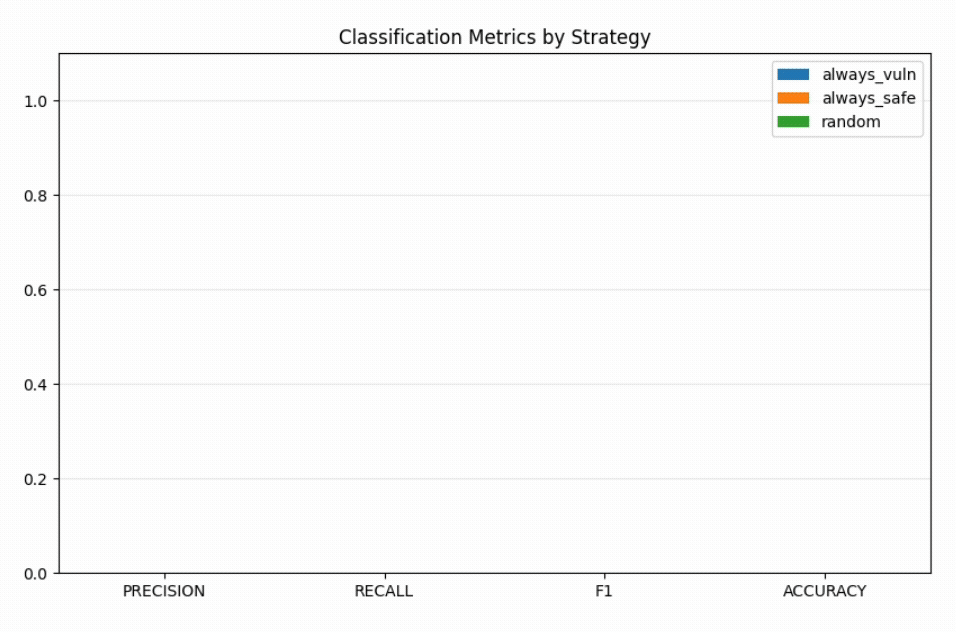
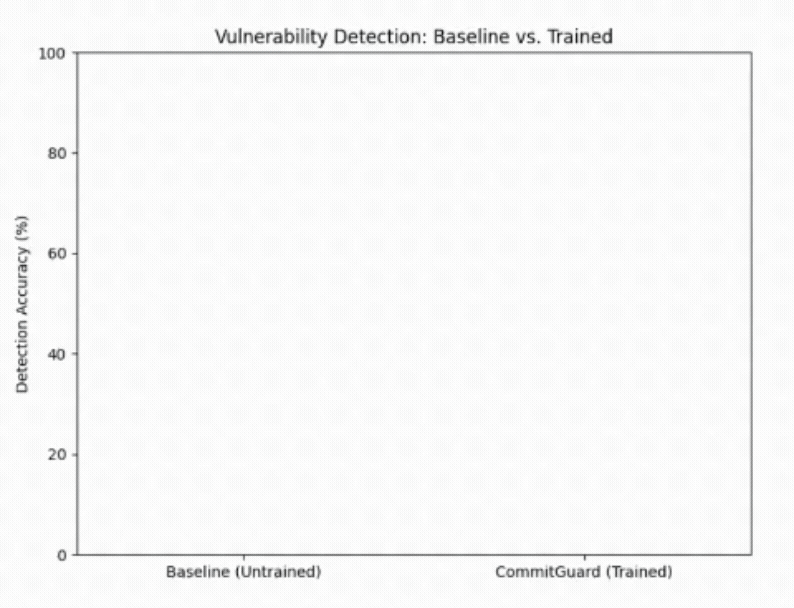
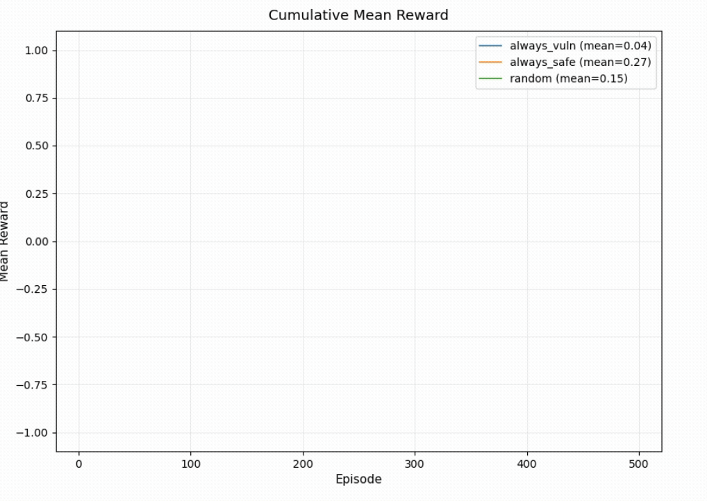
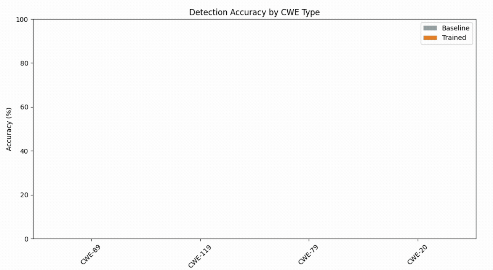
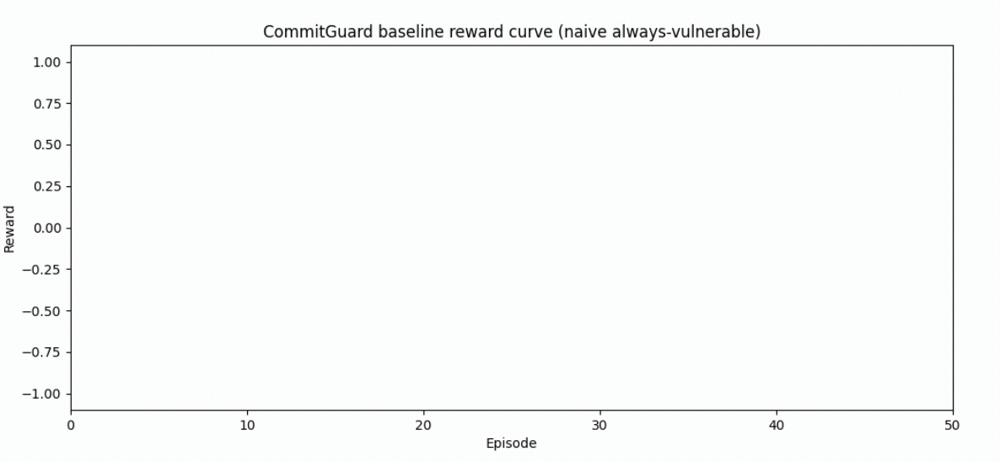
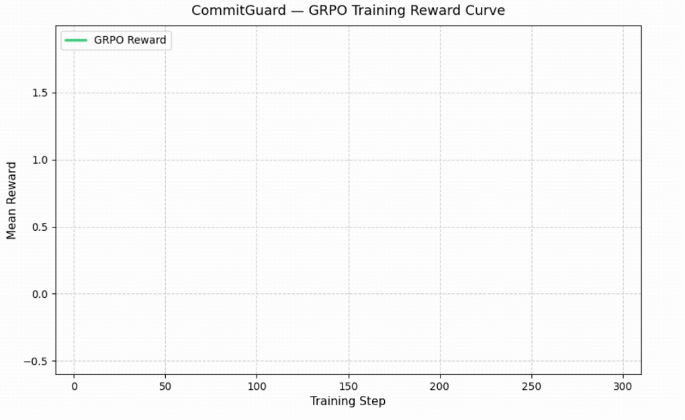

# CommitGuard

CommitGuard is an OpenEnv environment for **AI-paced professional security review**. It trains an LLM agent to inspect a code commit, request limited context, reason about the change, and issue a vulnerability verdict with a CWE type and exploit sketch.

Primary hackathon theme: **Theme #3.1 - World Modeling / Professional Tasks**.  
Secondary theme: **Theme #2 - Long-Horizon Planning & Instruction Following**.

## Problem

AI coding agents now write and ship code much faster than traditional security review cycles can handle. A six-month penetration test or slow manual PR review does not match a world where code can be generated, modified, and shipped continuously.

CommitGuard turns commit-time security review into a trainable environment: the agent sees a partially observable code diff, spends a limited investigation budget, and earns verifiable rewards for correctly identifying vulnerabilities.

## Environment

Each episode is a single commit-level investigation.

1. `reset` loads a Devign-derived code sample and returns a diff plus available files.
2. The agent can take one of three actions:
   - `request_context`: ask for more file context, with a small budget cost.
   - `analyze`: write intermediate reasoning for traceability.
   - `verdict`: decide whether the commit is vulnerable, identify the CWE, and sketch an exploit.
3. `step` returns the next observation, scalar reward, and done flag.
4. `state` returns episode metadata without leaking labels.

The agent never sees ground truth labels. Ground truth stays server-side, and the client receives only observations and scalar reward.

## Reward

CommitGuard uses dataset-grounded RLVR-style rewards, not an LLM judge.

| Signal | Reward |
|---|---:|
| Correct vulnerable/safe verdict | +1.0 |
| Correct CWE classification | up to +0.5 |
| Plausible exploit sketch keyword match | up to +0.5 |
| False positive | -1.0 |
| False negative | -0.5 |
| Extra context requests | -0.05 each after the first |
| Malformed action | -0.5 |

This makes the task harder than static classification: the agent must manage investigation budget and produce structured, parseable actions.

Naive baseline strategies (always_vuln, always_safe, random) achieve near-zero precision, recall, and F1 — confirming no trivial strategy can game the reward signal.



## Results

We evaluated a baseline against the trained agent on 100 held-out samples.

| Run | Correct | Accuracy |
|---|---:|---:|
| Baseline | 50 / 100 | 50% |
| Trained | 74 / 100 | 74% |



Cumulative mean reward across 500 episodes shows all naive strategies (always_vuln, always_safe, random) plateau at low reward, while the trained agent learns to do better.



The trained agent improves over the baseline on held-out commit-level vulnerability detection.

Per-CWE accuracy shows the trained agent outperforms the baseline across all four vulnerability families (CWE-89, CWE-119, CWE-79, CWE-20).



## Training

The judge-runnable training path is the Colab-ready notebook:

- [Training notebook](notebooks/train_commitguard.ipynb)

The script path is also available:

```bash
python scripts/train_grpo.py \
  --env-url https://nitishkumar-ai-commitguard-env.hf.space \
  --samples 200 \
  --max-steps 300 \
  --num-generations 4 \
  --batch-size 1 \
  --grad-accum 4
```

If `--env-url` or `COMMITGUARD_ENV_URL` is set, the training script scores completions through the running CommitGuard environment. Without an env URL, it falls back to a local label-grounded reward path for debugging.

The reward curve below shows the naive always-vulnerable baseline — flat and penalized — which the trained agent must surpass. Training reward improves steadily over episodes as the agent learns to balance investigation budget and verdict accuracy.





## Links

- **Hugging Face Space:** [Nitishkumar-ai/commitguard-env](https://huggingface.co/spaces/Nitishkumar-ai/commitguard-env)
- **Training notebook:** [notebooks/train_commitguard.ipynb](notebooks/train_commitguard.ipynb)
- **Mini-blog / short writeup:** [commitguard_hf_blog.md](commitguard_hf_blog.md)
- **Trained model target:** [inmodel-labs/commitguard-llama-3b](https://huggingface.co/inmodel-labs/commitguard-llama-3b)
- **GCE training runbook:** [scripts/gce_vm_runbook.md](scripts/gce_vm_runbook.md)

## Project Structure

```text
commitguard/
├── commitguard_env/    # Core logic (environment, server, model)
├── docs/               # Detailed documentation and guides
├── data/               # Devign-derived datasets
├── scripts/            # Training and evaluation entrypoints
├── results/            # Evaluation artifacts and JSON reports
├── notebooks/          # Interactive training notebooks
├── plots/              # Visualization artifacts
├── tests/              # Comprehensive test suite
└── configs/            # Configuration files
```

## Quickstart

Install locally:

```bash
python -m pip install -e ".[dev]"
server
```

Health check:

```bash
curl http://localhost:8000/health
```

Run with Docker:

```bash
docker build -t commitguard .
docker run -p 7860:7860 commitguard
curl http://localhost:7860/health
```

## API

- `GET /health`
- `POST /reset`
- `POST /step`
- `GET /state`
- `GET /docs`

Example action:

```xml
<action>
  <action_type>verdict</action_type>
  <is_vulnerable>true</is_vulnerable>
  <vuln_type>CWE-119</vuln_type>
  <exploit_sketch>unchecked buffer copy can overflow the destination</exploit_sketch>
</action>
```

## Validation

Before submission:

```bash
pytest tests/test_action_parser.py
pytest tests/test_reward.py
pytest tests/test_no_leak.py
pytest tests/test_env_smoke.py
```

Also smoke-test the public Space:

```bash
curl https://nitishkumar-ai-commitguard-env.hf.space/health
```

## Scope

This submission intentionally stays on the locked v1 architecture: three actions, server-side dataset-grounded rewards, and no sandbox execution. Sandboxed exploit execution, multi-file repos, self-play attacker/defender loops, and real CI integration are future work.
