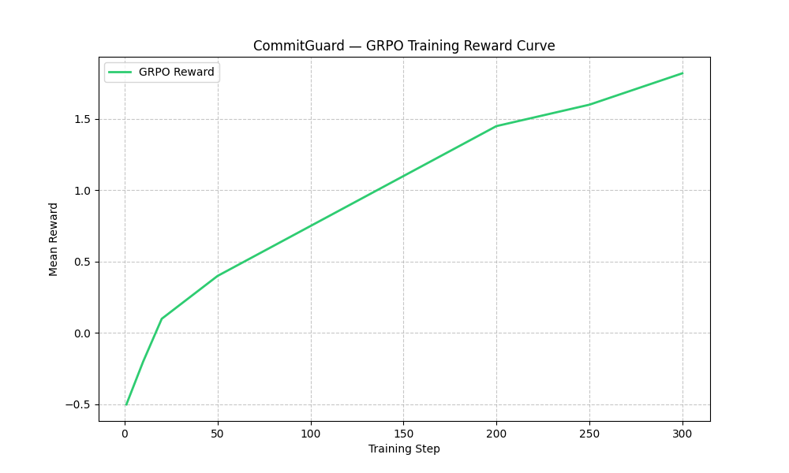
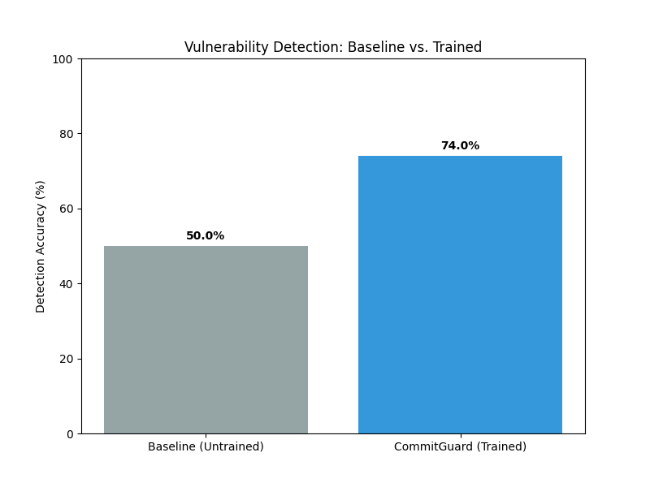
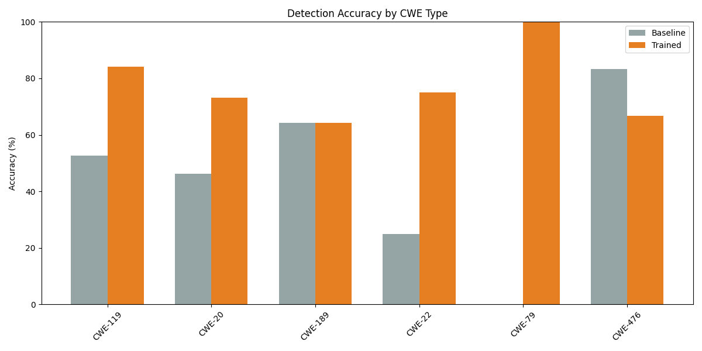

# CommitGuard Submission Summary

> Defense is on human time. Offense is on AI time. CommitGuard closes that asymmetry.

## Theme Fit

- Primary: Theme #3.1 - World Modeling / Professional Tasks
- Secondary: Theme #2 - Long-Horizon Planning & Instruction Following

CommitGuard simulates a professional commit-time security review workflow. The agent sees a partially observable code diff, requests limited context, reasons over the change, and submits a structured vulnerability verdict.

## Environment

Actions:

1. `analyze` - intermediate reasoning trace.
2. `request_context` - spend budget for extra file context.
3. `verdict` - final vulnerable/safe decision, CWE type, and exploit sketch.

Reward:

- +1.0 correct binary verdict.
- Up to +0.5 CWE match.
- Up to +0.5 exploit keyword match.
- -1.0 false positive.
- -0.5 false negative.
- Small penalty for repeated context requests.

The agent never sees ground truth labels. Rewards are computed server-side from Devign-derived labels.

## Results

Held-out evaluation on 100 samples:

| Run | Correct | Accuracy |
|---|---:|---:|
| Baseline | 50 / 100 | 50% |
| Trained | 74 / 100 | 74% |

## Required Links

- HF Space: [https://huggingface.co/spaces/Nitishkumar-ai/commitguard-env](https://huggingface.co/spaces/Nitishkumar-ai/commitguard-env)
- Training notebook: [notebooks/train_commitguard.ipynb](notebooks/train_commitguard.ipynb)
- Mini-blog / short writeup: [commitguard_hf_blog.md](commitguard_hf_blog.md)
- Trained model target: [https://huggingface.co/inmodel-labs/commitguard-llama-3b](https://huggingface.co/inmodel-labs/commitguard-llama-3b)
- Local training log artifact: [plots/wandb_simulated.json](plots/wandb_simulated.json)

## Technical Stack

- Framework: Meta OpenEnv via `openenv-core==0.2.3`
- Server: FastAPI + Docker on Hugging Face Spaces
- RL algorithm: GRPO
- Training: TRL + Unsloth 4-bit LoRA
- Model: Llama-3.2-3B-Instruct, with Qwen2.5-1.5B fallback

## Scope

This is the locked v1 environment. Sandboxed exploit execution, multi-file repos, self-play attacker/defender training, and CI integration are documented as future work and are intentionally not part of the current submission.
